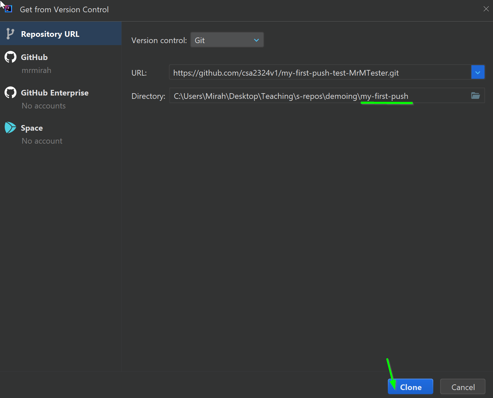

# Solo Quest: My First Push
**`Quest giver: Governor Nighthill`**
>Dagnabbit, how does this futuristic thing work?  Somebody tried explaining it but all I heard was jibber-jabber.  I can save something and push it to somewhere else?  I don't move anything myself, I only hit a button or two... sounds like sorcery!  I don't like it, I want nothing to do with it.  You figure it out and deal with it.

## Quest Overview
This introductory quest is to ensure that the cloning process, workflow, and submitting process can be completed smoothly.

If any issues occur during this process please ask for help.

This quest can be decomposed into four parts for those who prefer chunking (it is recommended to use decomposition on assignments so practicing on a simple assignment can help you start to hone these skills).

| Part Number      | Description                               |
| ---------------  | :--------------------------------------:  |
| Part 1           | Read this file                            |
| Part 2           | Get repo into IntelliJ                    |
| Part 3           | Completing quest tasks                     |
| Part 4           | Completing the quest                       |

## Part 1 - Reading through
### Objective 0 - How to use READMEs
We should have a small amount of comfort with Git and GitHub after our past couple of lectures.  This is our first time working through GitHub and submitting for a grade.

Whenever we receive a new project we should read over the entire README first to get an idea of what requirements we must meet.

## Part 2 - Getting this repo into IntelliJ
### Objective 1 - Cloning
Once we have read this document over and know our requirements we should start moving this project into IntelliJ, and we may begin coding.

This can be done from the main view page for the repository.  Before you start this process it is critical you are in the correct repo.  This can be verified if your username appears at the end of the repo name.

Once you have verified you are in the correct repo, look for button that reads `Code` (should be green).  Click it and then click the copy link button.  All of this can be seen in the picture below.  Green boxes highlight where to look.

With the link copied we should paste it into IntelliJ to get the project.  Depending on if you have other projects or not the clone IntelliJ button may appear different, it will look like one of the two images below, but you are looking for the words `Get from VCS`.

OR

Once selected we are shown a window that allows us to paste the URL we have copied.  First make sure you are in the correct folder for where you want to clone the project.  When the folder is correct you may paste the URL into the correct place.  After the URL is pasted, it is **critical** to make sure that there is a project in the folder you selected.  This is identified by the `\PROJECT-NAME` at the end of the folder line.  If there is not a `project-name` at the end then you must put a `\` and then project name yourself.  When everything is valid press the clone button at the bottom.

After pressing the clone button, click the `trust` button that appears on the popup.

Now the project is ready to begin.

#### Tasks to Complete for this Objective
- Clone this project into IntelliJ
    - remember to place it into a correct folder

If you are having difficulty doing the clone or are unsure about how to get it into a different folder please ask.

## Part 3 - Completing the raiding tasks
### Objective 1 - Main Method
This quest does not need us to create a class as there is one already provided.  The class is under src -> main -> java, if you drop down all those folders you will see `MyFirstPush` double-click on that file to open it.

However, to run our code or any code we need to create a main method.  All our Java quests in this course require a main method to be created somewhere.

It will be specified where to create the main within the objectives of each quest.

- Create a main method in the `MyFirstPush` class
    - main method should be between the {} of the class

The specifics for the main method can be seen on the code handout paper you will be receiving with this quest.

### Objective 2 - Copying Code
As the overall purpose of this quest is to ease us into and test the GitHub workflow, a physical handout will have some code for you to copy.  If we are not in school, or you did not get a physical handout there will be a picture of the code on the Schoology assignment.

Make sure when copying from the paper you include all the necessary `() "" ;` missing any of these will cause your code to have errors and not run.

Run your code to make sure you see some kind of output and not any errors.  Right click in the file and select the `Run MyFirstPush.main()` option.

#### Tasks to Complete for this Objective
- Copy the code on the paper handout given to you
- Run the code to see the outputs
    - right-click somewhere in the code file and select the `Run MyFirstPush.main()` it will have a little play symbol next to the option

## Part 4 - Completing the quest
### Objective 1 - Committing and Pushing
Receiving a grade on any quest means our code needs to be on GitHub correctly.  This means in the same folder structure.  Do not worry if you push your code it will be in the same folder structure.

This submitting phase is a three-step process: **`add, commit, and push`**.

We will not have to do any adding for this assignment.  However, you will need to commit. Remember the commit option can be found on the side panel inside IntelliJ.

In the commit panel you **MUST** select any and all the changed files.  Files will appear here if you have added new code into them, only the files you check off here will end up on GitHub.  After you have checked them off, you need to type out a commit message, and then hit the commit button at the bottom.

The push option is at the bottom in the `Git` icon.

When the `Git` panel opens you should see an `up arrow` next to the main branch.  This arrow indicates that this branch has commits ready to push to GitHub.  Right-click on this branch and then select the `push` option.

Finally, we are presented with the push window.  We can double-check here to make sure out commit message and correct files show up.  If everything looks in order we press the `Push` button.

After a couple of moments, we should see an approval message in the bottom right corner of IntelliJ.

Without doing these three steps our code will not be on GitHub.  This can then cause delays or penalties on our overall grade for a quest.  The "submitting" process is important to do.  As you should have been adding and committing through the entire quest (as you completed prior objectives) all that is left to do down here is a final push.

#### Tasks to Complete for this Objective
- Push all your commits to GitHub
    - It does not hurt to do a final "add and commit" before pushing to verify the latest version is up on GitHub

If you are struggling with these steps please ask.

#### Grading
|   Points   |   Requirement                               |
| :--------: |:------------------------------------------- |
| 1          | main method correct                         |
| 2          | all code from handout copied correctly      |
| 1          | push back to GitHub for grading             |
| 1          | more than a single commit made to the repo  |
