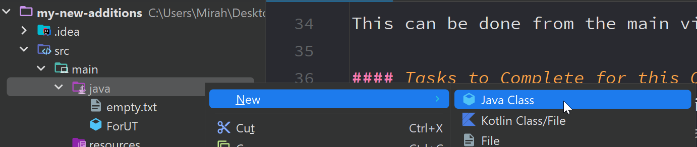
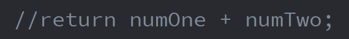
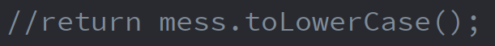
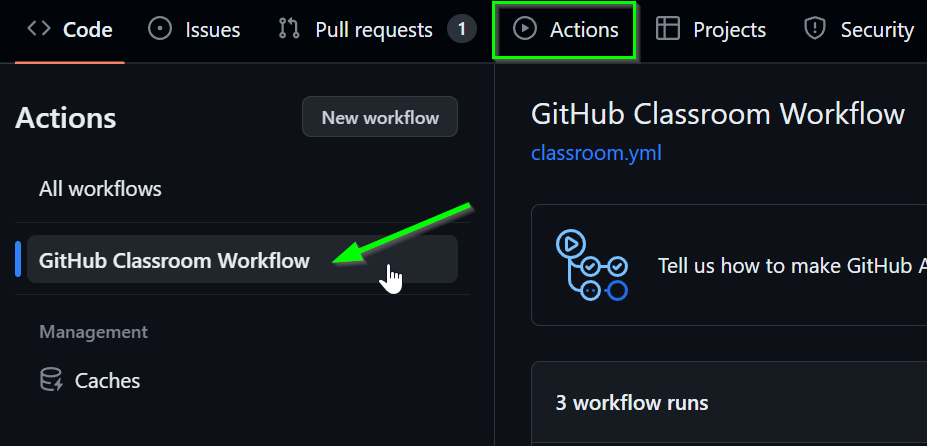
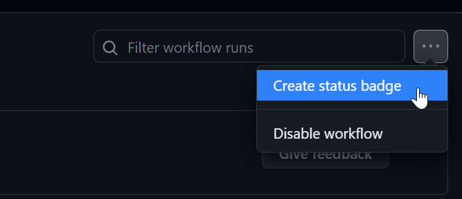
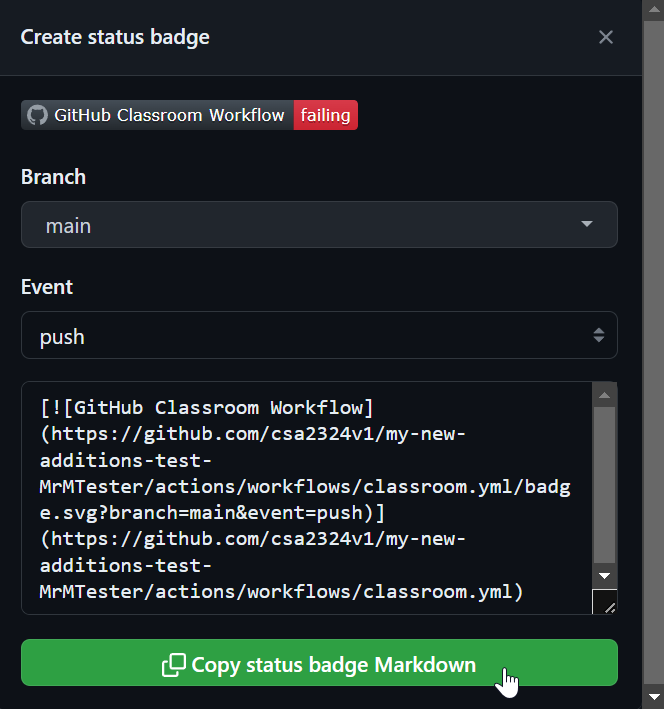

# Solo Quest: My New Additions
**`Quest giver: Governor Nighthill`**
>Zevius put some messages on this service for me and I have no idea how to retrieve them and respond. I am annoyed that he placed them here in the first place. I refuse to respond to such an inconsiderate action, respond to Zevius' questions for me.

## Objectives required to complete
This is a second introductory quest to verify that we can create classes when required and verify how to test our code working correctly against the unit tests.  We will also practice this updated workflow and the same submitting process as the `My First Push` quest.

As always ask me for assistance or clarification on any steps or if any help is required.

This quest can be decomposed into four parts for those who prefer chunking (it is recommended to use decomposition on assignments so practicing on a simple assignment can help you start to hone these skills).

We can start to realize that these "Parts" are large overview tasks of the entire quest.  Each part can be decomposed further as we see with the objectives.  Even if specific parts are not listed you can still decompose the quest from the regular objectives.

| Part Number      |                 Description                 |
| ---------------  |:-------------------------------------------:|
| Part 1           |          Reading the requirements           |
| Part 2           | Get repo into IntelliJ |
| Part 3           |           Completing quest tasks            |
| Part 4           |            Submitting the quest             |


## Part 1
### Objective 0 - How to use READMEs
We should have a small amount of comfort with Git and GitHub after our past couple of lectures.  This is our second time working through GitHub and submitting for a grade.

Whenever we receive a new project we should read over the entire README first to get an idea of what requirements we must meet.

We can also refer back to the `My First Push` repo to see all the pictures in there to verify we are doing all the right steps when it comes to cloning and pushing.

## Part 2 - Getting this repo into IntelliJ
### Objective 1 - Cloning
Once we have read through this `README` we want to get the repository into IntelliJ, so we can begin to work.

This can be done from the main view page for the repository.  The button that reads `Code` (should be green) must be clicked on to get the link needed.

#### Tasks to Complete for this Objective
- Clone this project into IntelliJ
    - remember to place it into a correct folder

If you are having difficulty doing the clone or are unsure about how to get it into a different folder please ask.

## Part 3 - Completing the Quest
### Objective 1 - MyNewAdditions Class
Often during quests, we will not have a class created for us.  In these instances, we need to create the class ourselves.

A class is what holds all of our code including the main method.  It is important to create the class in the correct location.  In future quests, classes created in the wrong location can cause severe frustration.



#### Tasks to Complete for this Objective
- Create a class called `MyNewAdditions`
    - make the class in the following location (-> denotes going to a sub-folder)
        - `src` -> `main` -> `java`

If you are having a hard time finding the correct location to place the class you can come and ask me.

### Objective 2 - Main Method
Remember that all of our quests require a main method to be made somewhere.   In these first quests, we only have a single class to work within, however, on larger quests, the specific class for the main method will be listed in the objective.

#### Tasks to Complete for this Objective
- Create a main method in the `MyNewAdditions` class

The specifics for the main method can be seen in your `MyFirstPush` program.

### Objective 3 - Answering Zevius
This quest has the goal of enforcing more practice with the GitHub process.  However, it introduces some small, but crucial abilities we will need to have for other quests.

Respond appropriately to Zevius' questions, we will want to put some print statements within our main method.  Zevius has three questions this time:

```
What time does the Hogwarts Express leave Platform 9 and 3/4?
Which London pub hides the entrance to Diagon Alley?
What is the name of the Weasley twins' magic joke shop?
```

As much overkill as it may seem, do a **commit** after each question-answer pair is made to start building good habits.

Oh yeah btw, **GOOGLE THE ANSWERS IF YOU DO NOT KNOW THEM**.  The goal of this quest is not to test your Harry Potter trivia knowledge.  This will be the only time I allow or tell you to Google an answer to a question so take advantage of it on this single quest.

#### Tasks to Complete for this Objective
- Have print statements for each of the questions from Zevius
- Respond to Zevius' questions with three different print statements
- You should have 6 print statements in total
    - this means BOTH questions and answers need to be in print statements

The syntax for a print statement can be seen in the `MyFirstPush` quest you completed.

### Objective 4 - Uncommenting Code for Unit Test
After we have completed the above quest, let us see if our GitHub repo can display unit test passing or not.

Open up the `ForUT` file in the `java` folder.  In that file uncomment the two lines of code that have the word return on them.  To uncomment them delete the two `//` at the start of the line.





### Objective 5 - Writing the Unit Test
After uncommenting the code, we must write unit test to make sure the code works.

#### Tasks to Complete for this Objective
- Open Test file
- Write unit tests to receive passing marks on the file

### Objective 6 - Getting a Build Badge
It is possible to check the passing of your code from within IntelliJ.  We can discuss how to do that during separately if needed.

To get this badge you will need to go to GitHub and then get some code and paste that code into your README inside IntelliJ.

**On GitHub**
- Click on the "Actions" tab in the top section under your repo name
- Select the "GitHub Classroom Workflow" on the left-hand side



- Click on the "..." button that is next to the search bar on the page
    - Select "Create status badge" from the dropdown menu




- On the window, the pops open
    - Branch choose "main" from the options
    - Event choose "push" from the options
    - Click the green "Copy" button at the bottom of this page



**In IntelliJ**
- Open the README.md file by double-clicking on it from the "Project Panel"
- Paste your badge code at the very top
    - Make a new space at the top and paste it above everything else

Each time we make a push to GitHub the badge will update to show "Error", "failing", and "success" to let us know the status of our code against the unit tests written.

## Part 4 - Completing the quest
### Objective 1 - Pushing
Receiving a grade on any quest means our code needs to be on GitHub correctly.  This means in the same folder structure.  Do not worry if you push your code it will be in the same folder structure.

This submitting phase is a three-step process: **`add, commit, and push`**.

Without doing these three steps our code will not be on GitHub.  This can then cause delays or penalties on our overall grade for a quest.  The "submitting" process is important to do.  As you should have been adding and committing through the entire quest (as you completed prior objectives) all that is left to do down here is a final push.

- Push all your commits to GitHub
    - It does not hurt to do a final "add and commit" before pushing to verify the latest version is up on GitHub

If you are struggling with these steps please ask.


#### Grading
|   Points     |   Requirement                               |
| :----------: |:------------------------------------------- |
| 1            | created appropriate dev branch              |
| 1            | created the correct class                   |
| 1            | main method correct                         |
| 3            | answered Zevius' messages                   |
| 4            | unit tests written and working          |
